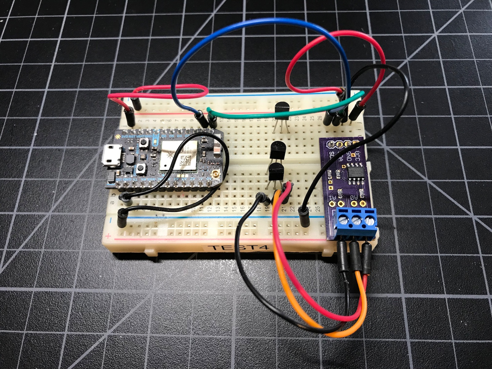
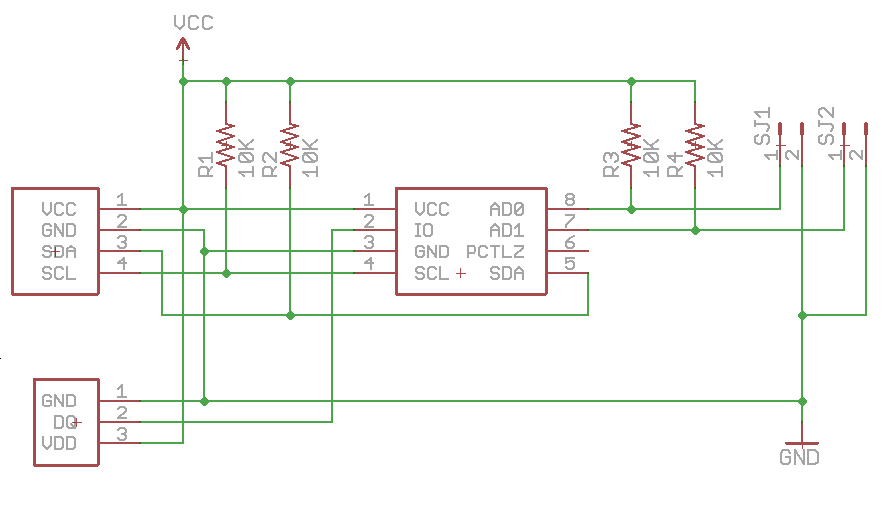
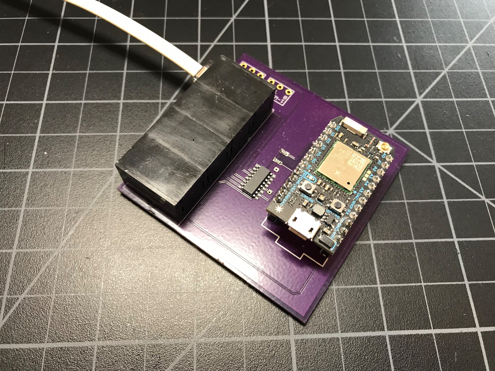
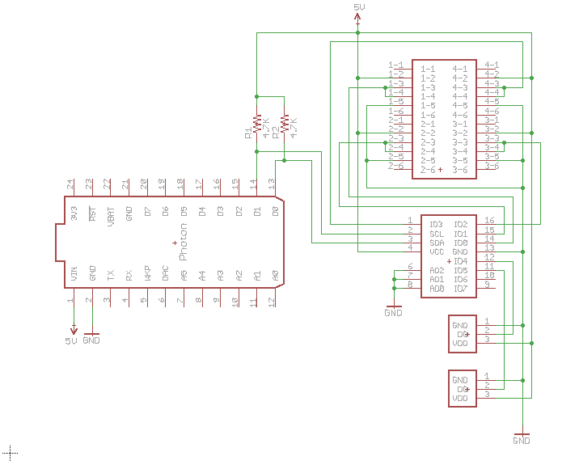
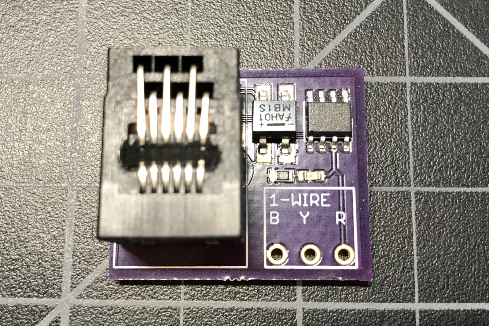
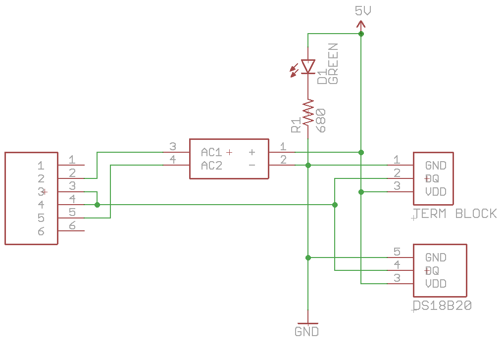
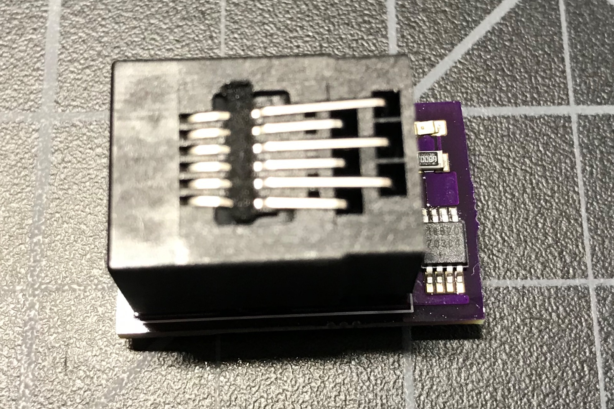
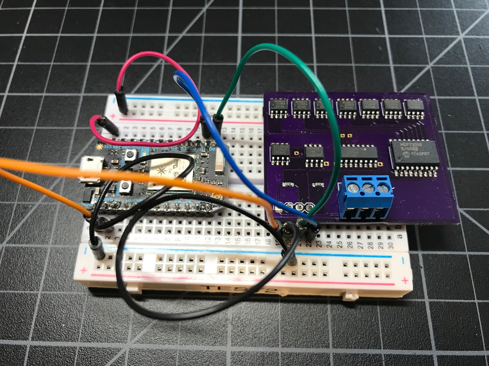
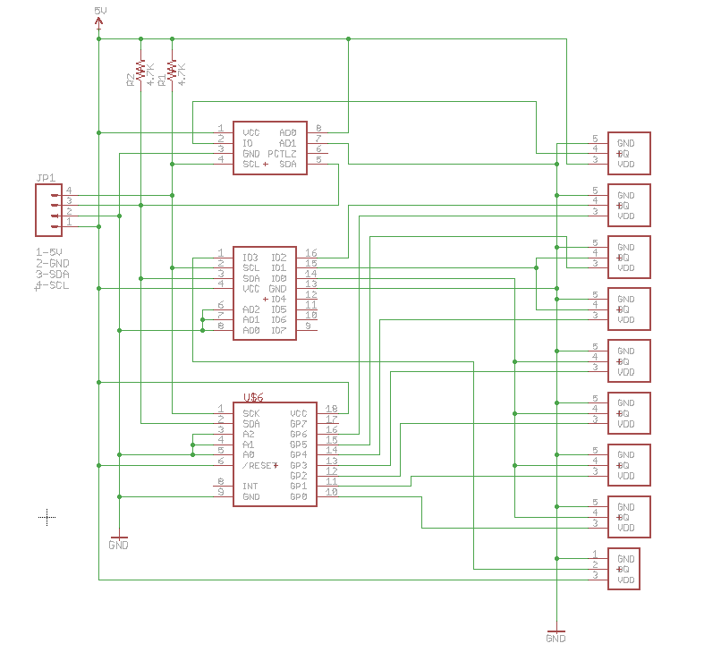

# DS2482 Library

The DS2482 is an I2C to 1-wire interface chip. It comes in two versions, the DS2482-100 (1-port) and DS2482-800 (8-port). Using an interface chip is helpful because most DS18B20/1-wire libraries use timing sensitive code and may run for extended periods with interrupts disabled. This can cause the rest of your program to have poor performance. 

The library fully supports both single-drop and multi-drop modes, allowing many DS18B20 sensors on a single 1-wire bus.

The DS2482 library is completely asynchronous, never blocking for more than the time to do an I2C read or write. Interrupts are never disabled.

Every call uses a C++11 lambda completion handler. The second part of this document has a bit of explanation of why and how it works.

The DS2482 also has an internal transistor to pull the 1-wire bus high during temperature conversion and flash writes. This allows the use of parasitic power mode, requiring only two wires for sensors (DQ and GND), with no separate power line. The library supports this as well.

The full API documentation can be browsed at [http://rickkas7.github.io/DS2482-RK/](http://rickkas7.github.io/DS2482-RK/). The same HTML documentation is in the docs folder in Github.

The official Github is: [https://github.com/rickkas7/DS2482-RK](https://github.com/rickkas7/DS2482-RK).

It's in the Particle community libraries as DS2482-RK.

## Common tasks

### Get temperature of one sensor (single-drop)

The code is also in examples, in the 01-single-drop directory.

```
#include "DS2482.h"

SerialLogHandler logHandler;

DS2482 ds(Wire, 3);

const unsigned long CHECK_PERIOD = 30000;
unsigned long lastCheck = 5000 - CHECK_PERIOD;

void setup() {
	Serial.begin(9600);
	ds.setup();

	DS2482DeviceReset::run(ds, [](DS2482DeviceReset&, int status) {
		Serial.printlnf("deviceReset=%d", status);
	});

	Serial.println("setup complete");
}


void loop() {

	ds.loop();

	if (millis() - lastCheck >= CHECK_PERIOD) {
		lastCheck = millis();

		// For single-drop you can pass an empty address to get the temperature of the only
		// sensor on the 1-wire bus
		DS24821WireAddress addr;

		DS2482GetTemperatureCommand::run(ds, addr, [](DS2482GetTemperatureCommand&, int status, float tempC) {
			if (status == DS2482Command::RESULT_DONE) {
				char buf[32];
				snprintf(buf, sizeof(buf), "%.4f", tempC);

				Serial.printlnf("temperature=%s deg C", buf);
				Particle.publish("temperature", buf, PRIVATE);
			}
			else {
				Serial.printlnf("DS2482GetTemperatureCommand failed status=%d", status);
			}
		});
	}
}
```

### Get temperatures of multiple sensors (multi-drop)

The code is also in examples, in the 02-multi-drop directory.

```
#include "DS2482.h"

SerialLogHandler logHandler;

DS2482 ds(Wire, 3);

DS2482DeviceListStatic<10> deviceList;
const unsigned long CHECK_PERIOD = 30000;
unsigned long lastCheck = 10000 - CHECK_PERIOD;

void setup() {
	Serial.begin(9600);
	ds.setup();

	DS2482DeviceReset::run(ds, [](DS2482DeviceReset&, int status) {
		Serial.printlnf("deviceReset=%d", status);
		DS2482SearchBusCommand::run(ds, deviceList, [](DS2482SearchBusCommand &obj, int status) {

			if (status != DS2482Command::RESULT_DONE) {
				Serial.printlnf("DS2482SearchBusCommand status=%d", status);
				return;
			}

			Serial.printlnf("Found %u devices", deviceList.getDeviceCount());
		});
	});

	Serial.println("setup complete");
}


void loop() {

	ds.loop();

	if (millis() - lastCheck >= CHECK_PERIOD) {
		lastCheck = millis();

		if (deviceList.getDeviceCount() > 0) {

			DS2482GetTemperatureForListCommand::run(ds, deviceList, [](DS2482GetTemperatureForListCommand&, int status, DS2482DeviceList &deviceList) {
				if (status != DS2482Command::RESULT_DONE) {
					Serial.printlnf("DS2482GetTemperatureForListCommand status=%d", status);
					return;
				}

				Serial.printlnf("got temperatures!");

				for(size_t ii = 0; ii < deviceList.getDeviceCount(); ii++) {
					Serial.printlnf("%s valid=%d C=%f F=%f",
							deviceList.getAddressByIndex(ii).toString().c_str(),
							deviceList.getDeviceByIndex(ii).getValid(),
							deviceList.getDeviceByIndex(ii).getTemperatureC(),
							deviceList.getDeviceByIndex(ii).getTemperatureF());
				}

			});
		}
		else {
			Serial.printlnf("no devices found");
		}
	}
}
```

### Multi-drop with parasitic power

Just as the previous example, except within loop the call to D2482GetTemperatureListCommand::run has an extra optional fluent parameter, `.withParasiticPower()`.

```
			DS2482GetTemperatureForListCommand::run(ds, deviceList, [](DS2482GetTemperatureForListCommand&, int status, DS2482DeviceList &deviceList) {
				if (status != DS2482Command::RESULT_DONE) {
					Serial.printlnf("DS2482GetTemperatureForListCommand status=%d", status);
					return;
				}

				Serial.printlnf("got temperatures!");

				for(size_t ii = 0; ii < deviceList.getDeviceCount(); ii++) {
					Serial.printlnf("%s valid=%d C=%f F=%f",
							deviceList.getAddressByIndex(ii).toString().c_str(),
							deviceList.getDeviceByIndex(ii).getValid(),
							deviceList.getDeviceByIndex(ii).getTemperatureC(),
							deviceList.getDeviceByIndex(ii).getTemperatureF());
				}

			}).withParasiticPower();
```

### Multi-drop with JSON publish

This example is like the previous, except it publishes multiple sensor values via a single Particle.publish in JSON format (up to 10 DS18B20s supported).

The full examples is only in github, in the test-projects/10-multidrop-json directory. This is because it requires another library, JsonParserGeneratorRK, in addition to DS2482-RK.

```
#include "DS2482.h"
#include "JsonParserGeneratorRK.h"

SerialLogHandler logHandler;

DS2482 ds(Wire, 3);

DS2482DeviceListStatic<10> deviceList;
JsonWriterStatic<256> jsonWriter;

const unsigned long CHECK_PERIOD = 30000;
unsigned long lastCheck = 10000 - CHECK_PERIOD;

void setup() {
	Serial.begin(9600);
	ds.setup();

	DS2482DeviceReset::run(ds, [](DS2482DeviceReset&, int status) {
		Serial.printlnf("deviceReset=%d", status);
		DS2482SearchBusCommand::run(ds, deviceList, [](DS2482SearchBusCommand &obj, int status) {

			if (status != DS2482Command::RESULT_DONE) {
				Serial.printlnf("DS2482SearchBusCommand status=%d", status);
				return;
			}

			Serial.printlnf("Found %u devices", deviceList.getDeviceCount());
		});
	});

	Serial.println("setup complete");
}


void loop() {

	ds.loop();

	if (millis() - lastCheck >= CHECK_PERIOD) {
		lastCheck = millis();

		if (deviceList.getDeviceCount() > 0) {

			DS2482GetTemperatureForListCommand::run(ds, deviceList, [](DS2482GetTemperatureForListCommand&, int status, DS2482DeviceList &deviceList) {
				if (status != DS2482Command::RESULT_DONE) {
					Serial.printlnf("DS2482GetTemperatureForListCommand status=%d", status);
					return;
				}

				Serial.printlnf("got temperatures!");

				// Initialize the JsonWriter object and sets it to send 2 decimal places
				jsonWriter.init();
				jsonWriter.setFloatPlaces(2);

				// startObject is for the outer object and must be balanced with finishObjectOrArray.
				jsonWriter.startObject();

				// Write the actual temperatures
				for(size_t ii = 0; ii < deviceList.getDeviceCount(); ii++) {
					if (deviceList.getDeviceByIndex(ii).getValid()) {
						// This creates a key of the form "t0" for the first, "t1" for the second, ...
						char key[4];
						key[0] = 't';
						key[1] = '0' + ii;
						key[2] = 0;

						// Inserts the float as a key value pair
						jsonWriter.insertKeyValue(key, deviceList.getDeviceByIndex(ii).getTemperatureC());
					}
				}

				jsonWriter.finishObjectOrArray();

				Serial.println(jsonWriter.getBuffer());
				Particle.publish("temperature", jsonWriter.getBuffer(), PRIVATE);

				// Example output:
				// {"t0":23.56,"t1":23.12}
			});
		}
		else {
			Serial.printlnf("no devices found");
		}
	}
}
```

Example serial output:

```
got temperatures!
{"t0":23.56,"t1":23.12}
```

Because the 1-wire bus search is deterministic, it will always returns the sensors in the same order, sorted by 1-wire device address (increasing).

### Test Suite

There's a test suite for the library in Github, in test-projects/11-testboard. This is a hardware and software combination used to do regression testing on the library.

## About lambdas, fluent-style and more

The DS2482 library uses a C++11 style of coding that is very powerful, but will probably be foreign to you if you learned old-school C and C++. It's actually more like the way Javascript/node.js is programmed.

One of the main advantages of the DS2482 library is that it's completely asynchronous. No call blocks for more than the time it takes to make an I2C transfer. This is important because getting a temperature sensor reading can take 750 milliseconds, and most DS18B20 software libraries block during conversion.

### Synchronous way

Using the [DS18B20 library](https://build.particle.io/libs/DS18B20/0.1.7/tab/DS18B20.cpp), you make a call like this:

```
float tempC = ds.getTemperature(addr);
```

The main loop thread is blocked during this call for 750 milliseconds, which may affect performance elsewhere in your code. 

### State machines

One common way of implementing asynchronous code is state machines. This is a bit of pseudo-code of what a state machine version might look like. 

```
void loop() {
	switch(state) {
	case GET_TEMPERATURE_STATE:
		ds.startTemperature();
		state = TEMPERATURE_WAIT_STATE;
		break;

	case TEMPERATURE_WAIT_STATE:
		if (ds.isTemperatureDone()) {
			float temp = ds.readTemperature();
			state = ANOTHER_STATE;
		}
		break;
	}
}
```

State machines are really powerful, and actually how the DS2482 library is implemented internally, but can get a bit unwieldy.

### Callbacks

Callback functions are another common way of handling asynchronous code, like in this pseudo-code example:

```
void temperatureCallback(float temp) {
	Serial.printlnf("got temperature %f", temp);
}

void loop() {
	if (millis() - lastCheck >= CHECK_PERIOD) {
		lastCheck = millis();
		ds.getTemperature(temperatureCallback);
	}
}
```

The problem with callbacks is that it's a pain to pass state data to the callback, and it requires some effort to make a callback handler a class member function.

### The Lambda

The lambda solves some of the problems with callbacks. Here's an example of doing an asynchronous device reset call:

```
void setup() {
	Serial.begin(9600);
	ds.setup();

	DS2482DeviceReset::run(ds, [](DS2482DeviceReset&, int status) {
		Serial.printlnf("deviceReset=%d", status);
	});

	Serial.println("setup complete");
}
```

The syntax is a little weird, and I'll get to that a moment, however the important thing is that this block of code, the lambda, is executed later.

```
	[](DS2482DeviceReset&, int status) {
		Serial.printlnf("deviceReset=%d", status);
	}
```

The 

```
setup complete
```

message appears next.

When the asynchronous device reset completes, the block runs and

```
deviceReset=1
``` 

will likely be printed to the serial console. Note, however, that the lines after the block, like printing setup complete! won't happen a second time.


A declaration of a lambda function looks like 

```
[](DS2482DeviceReset&, int status) {
	// Code goes here
}
``` 

The `[]` part is the capture, which we'll discuss in a moment, and `(DS2482DeviceReset&, int status)` is a function parameter declaration. Basically the callback is a function that takes two parameters, a `DS2482DeviceReset&` object (not used here) and an `int status` (for status).

### Nesting calls

This example demonstrates two handy things:

- Making your lambda be a class member
- Nesting lambdas for sequential operations

```
void TestClass::check() {
	DS2482SearchBusCommand::run(ds, deviceList, [this](DS2482SearchBusCommand &obj, int status) {

		if (status != DS2482Command::RESULT_DONE) {
			Serial.printlnf("DS2482SearchBusCommand status=%d", status);
			return;
		}

		if (deviceList.getDeviceCount() == 0) {
			Serial.println("no devices");
			return;
		}

		DS2482GetTemperatureForListCommand::run(ds, obj.getDeviceList(), [this](DS2482GetTemperatureForListCommand&, int status, DS2482DeviceList &deviceList) {
			if (status != DS2482Command::RESULT_DONE) {
				Serial.printlnf("DS2482GetTemperatureForListCommand status=%d", status);
				return;
			}

			Serial.printlnf("got temperatures!");

			for(size_t ii = 0; ii < deviceList.getDeviceCount(); ii++) {
				Serial.printlnf("%s valid=%d C=%f F=%f",
						deviceList.getAddressByIndex(ii).toString().c_str(),
						deviceList.getDeviceByIndex(ii).getValid(),
						deviceList.getDeviceByIndex(ii).getTemperatureC(),
						deviceList.getDeviceByIndex(ii).getTemperatureF());
			}

		});
	});
}
```

You'll notice the slightly different syntax in the capture, the part in the square brackets:

```
DS2482SearchBusCommand::run(ds, deviceList, [this](DS2482SearchBusCommand &obj, int status) {
```

Instead of just being `[]` it's `[this]`. That means that `this`, your class instance, is captured, and available inside the lambda. It essentially makes the inner function a class member, available to access class member functions and variables.

You can capture multiple variables, separated by commas. You can capture function parameters and local variables, for example.

The other thing is that you can nest these, so each new indent in occurs at a later time. If you don't like that style, however, you can just split your code into separate member functions like this:

```
void TestClass::searchBus() {

	DS2482SearchBusCommand::run(ds, deviceList, [this](DS2482SearchBusCommand &obj, int status) {

		if (status != DS2482Command::RESULT_DONE) {
			Serial.printlnf("DS2482SearchBusCommand status=%d", status);
			return;
		}

		if (deviceList.getDeviceCount() == 0) {
			Serial.println("no devices");
			return;
		}

		getTemperatures();
	});
}

void TestClass::getTemperatures() {

	DS2482GetTemperatureForListCommand::run(ds, deviceList, [this](DS2482GetTemperatureForListCommand&, int status, DS2482DeviceList &deviceList) {
		if (status != DS2482Command::RESULT_DONE) {
			Serial.printlnf("DS2482GetTemperatureForListCommand status=%d", status);
			return;
		}

		Serial.printlnf("got temperatures!");

		for(size_t ii = 0; ii < deviceList.getDeviceCount(); ii++) {
			Serial.printlnf("%s valid=%d C=%f F=%f",
					deviceList.getAddressByIndex(ii).toString().c_str(),
					deviceList.getDeviceByIndex(ii).getValid(),
					deviceList.getDeviceByIndex(ii).getTemperatureC(),
					deviceList.getDeviceByIndex(ii).getTemperatureF());
		}
	});

}
```

### Optional parameters

Within the library, optional parameters are passed fluent-style instead of using C++ optional parameters. The fluent-style parameters are easier to identify and don't depend on order. For example:

```
DS2482GetTemperatureCommand::run(ds, addr, [this,completion](DS2482GetTemperatureCommand&, int status, float t) {
		if (status != DS2482Command::RESULT_DONE) {
			Log.error("FAILURE DS2482GetTemperatureCommand failed %d bus %s", status, name.c_str());
			completion();
			return;
		}

		testsComplete(completion);
	}).withParasiticPower(isParasiticPowered).withMaxRetries(1);
```

Of note:

- The optional parameters go after the `})` that closes the run command.
- You can chain as many or as few as you want in any order.
- The names all begin with `with`.

In this example, it uses parasitic power or not based on the member variable `isParasiticPowered` and limits the number of retries to 1.


### Run methods

All of the asynchronous functions are implemented as separate classes with a static run method. For example `DS2482GetTemperatureCommand::run`.

This is done because the objects need to be allocated on the heap (using new), not stack allocated. Since they continue after your function returns, stack allocated classes wouldn't work because they would go away when the enclosing function returns.

The run methods take care of allocated the objects and enqueueing them for execution so they make sure the objects gets deleted later, as well.

## Hardware examples

The hardware examples are in Github in the hardware directory. The Eagle board and schematic files are there as well.

### 1-port

This is a simple breakout board for the DS2482-100 (1-port):






### 8-port

This is a simple board for the DS2482-800 (8-port), though it's only populated for 6 ports. Four of them are modular jacks, designed to connect with one of the remote sensors below.






### DS18B20-regular

This is a simple DS18B20 remote sensor with a modular connector. The extra chip is a bridge rectifier, which makes it tolerant of having the connector polarity reversed, for example yellow and black reversed. This happens frequently when the flat cable is used and there isn't the proper twist in it.






### DS18B20-Mini

This is an even smaller DS18B20 remote sensor with a modular connector. It leaves off the screw terminal space and does not include the bridge rectifier, so make sure you don't cross the yellow and black wires!




### test-board

This is how I regression test the library. It's a board with DS2482-100 (1-port), DS2482-800 (8-port), 8x DS18B20s, and MCP23008 so I can switch the DS18B20s between powered and parasitic power mode individually.






